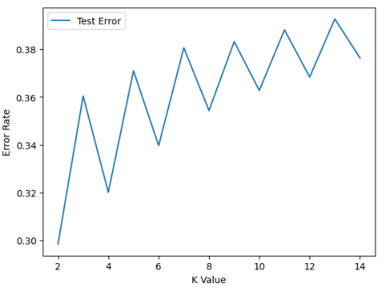
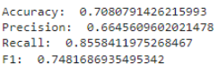
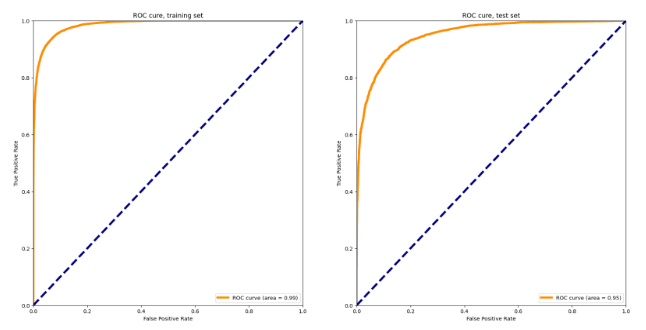
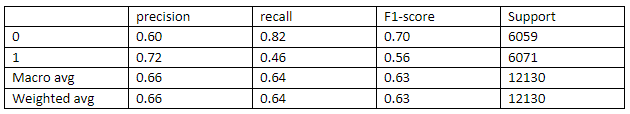
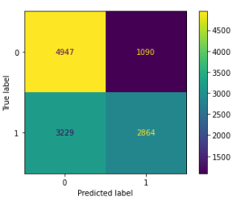
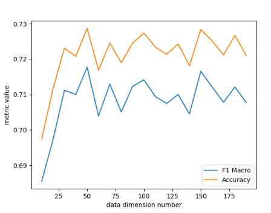

# Fake Review Detection

## Presentation

[Project Proposal](https://www.youtube.com/watch?v=D6XXeTkjEC0&ab_channel=hanCao)

[Final Video](https://youtu.be/q9vhpKbgqtA)

## Contributors
- Yuanzhi Liu, yliu3201@gatech.edu
- Jongyoon Choi, jchoi471@gatech.edu
- Han Cao, hcao73@gatech.edu
- Jianjun Xia, jxia81@gatech.edu
- Yi-Chia Chen, ychen3481@gatech.edu

## Intro/background 

As more and more people shop online, product reviews became crucial in persuading the customers whether to buy the items or not. Reviews can often make or break the purchase, which led to many fake reviews being written influence buyers. Therefore, it is important to know how to distinguish between the real and the fake to be well informed. 

The fake review detection problem is still an ongoing problem, and there are various studies related to it. A. Molla (2017) utilized methods such as Naïve Bayes, Decision tree, SVM, Rainforest, etc. to detect fake reviews from negative tweets they had gathered on Samsung products and their services. Also, Y. Ren et al. (2017) used models such as neural and discrete models with CNN, RNN, GRNN, etc. for detecting deceitful opinion spamming. 

 

## Problem definition

- What are the factors that determine whether the review is fake? 

- How could we best predict the fake review by using rating polarity, keyword, review heading, and review body? 

## Data Collection

We will be using a data set containing 20k fake reviews and 20k real product reviews from [OSF](https://osf.io/tyue9/). The data is classified as original reviews and computer-generated fake reviews.

## Data Preprocessing 

The dataset we used contains two columns: 1 column contains the review as text, and another column contains the label for this text, in which rows labeled “OR” means original review and rows labeled “CG” represents computer generated review. Since we are dealing with binary classification, we will categorize computer generated review with label of 1 and real human review with label of 0.  

One preprocessing step we use to clean our dataset is converting punctuations into words. Since our text contains many punctuations, such as exclamation marks, question marks, or quotations, the existence of punctuation can be an important feature for classifying fake and real review based on sentient. We can preserve this feature first by converting these punctuations to their corresponding words. For example, we can convert “!” to “exclamation” and “?” to “question”.  

Next preprocessing technique we use is to tokenize the text by splitting the entire review into a list of words, and we will remove stop words from the list. Stops words are words with low information, such as “a”, “this”, “the”. These words are too common to appear in any text which does not give our algorithm an indication of review and fake reviews. So we will remove these stop words from our reviews using a lookup set of English stop words from nltk. 

The last technique we used to preprocess our review is by applying stemming to every word in our review. Since English words can come in multiple forms, such as “comforting”, “comfortable”, which could have the same meaning, we should convert these words into its stem form. For example, we will convert “comfortable” into “comfort”, and “information” into “inform”. This technique will condense words with the same meaning into same words, thus reducing the size of word dictionary. 

After cleaning our words using various preprocessing techniques, we will join the list of words back together to form a string of review, which we will later pass into our machine learning algorithms. 

**Before Preprocessing**

  

**After Preprocessing**

  

## Methods: 

### Supervised 

To determine which classification method is best at detecting fake reviews, Elmogy et al. (2021) examined and compared the average F-1 score between different supervised machine learning algorithms in which they concluded that KNN algorithm outperforms the other algorithm with the highest f-1 score. As a result, my team would like to examine and verify the efficacy of classifying fake reviews and real reviews using three use three supervised training methods, KNN, SVM, and Logistic Regression.

#### KNN 

Even though Elmogy et al.’s (2021) research finds that KNN outperforms other machine learning algorithms in terms of classifying fake and real reviews, my result does not seem to match his claim. After preprocessing our data, I convert the text data from our dataset into vectors first using TfidfVectorizer. I use TfidfVectorizer instead of CountVectorizer because TfidVectorizer considers the overal document weight of a word while CountVectorizer only consider the frequency of words. Since the result of TfidfVectorizor is a SparseMatrix, dimensionality reduction methods like PCA will not work in this case.  

To find the best k-value for KNN, I fit the KNN model to the dataset using different k ranging from 2 to 10. Then, I plot the k-value vs. Error graph and look at the graph to determine the best k value for the KNN model.  

#### SVM
Because the fake product review classification is a binary classification, we utilized support vector machine model because it works reasonably well when there is an understandable margin of dissociation between the classes. 

To find the best accuracy, we fit the SVM model to different kernels and C-values. We tried linear, poly, and rbf kernels and found that linear consistently yielded the best results. Furthermore, with other parameters set as default, we tried tuning the SVM regularization parameter C with the kernel as linear. 

#### Logistic Regression:

When building Logistic Regression model, we also first did data preprocessing, as the way mentioned above. Then we applied scikit-learn’s CountVectorizer, which is essentially the bag-of-words model, to convert string tokens to a row of numerical values. Each value represents a word count corresponding to the unique word that the column represents. We also use TfidfTransformer, which returns the normalized word counts by dividing the number with the word’s appearance frequency among all documents. 

On the other hand, scikit-learn’s LogisticRegression allows us to customize several hyperparameters, such as penalty, including l1, l2, no penalty, etc., solver, including liblinear (coordinate descent), sag (Stochastic Average Gradient), lbfgs (the Broyden–Fletcher–Goldfarb–Shanno algorithm), etc., and maximum number of iterations. 

### Unsupervised

Some unsupervised leaning algorithms have been applied in similar tasks.  In opinion spam detection challenge, researchers have proposed an unsupervised method, Latent Spam Model (LSM). A novel generative model for deception classification that can exploit both linguistic and behavioral footprints left behind by spammers.  Inspired by this paper, we can treat fake review detection as a clustering problem. Learning exploits distributional feature differences between fake reviewers and other.  Our team plan to apply unsupervised learning methods like k-means, GMM to tackle this task.

#### K means 

One of the unsupervised methods we take for the fake review classification is K-means, as K-means clustering is a method of vector quantization, that aims to partition n observations into k clusters in which each observation belongs to the cluster with the nearest mean (cluster centers or cluster centroid). This results in a partitioning of the data space into k different classes. Since there are only two labels (fake review or not) for this task, we simply choose cluster number K as 2. Before training, we initialize the centers of those two clusters by computing the mean values of the data with different labels. We discard the labels of those training data and fit the K-means model in two clusters. Then we use the model to predict the test data and evaluate the results. We also have tried PCA to select more important features and reduce the dimension of input data, so that we can transform the data into more compact form for training. 

#### Spectral Clustering 

Before we chose the Spectral Clustering, we tried GMM but the F1 score and accuracy will never go past 50 percent, this could be due to many factors, such as the word encoder we use might not fit GMM well, or not enough preprocessing on the dataset. Later, we switched to Spectral Clustering, which got a better result. Before we used TfidfVectorizer for the encoder, we used CountVectorizer for the word encoder, but this resulted in PCA never finishing running the dataset. The fit process of PCA ran for 1 hour and was forced to stop. With TfidfVectorizer, PCA needs less than 1 minute to fit.  

Another unsupervised method we train and use for the fake review classification is Spectral Clustering. We chose it because Spectral Clustering works well when there are few clusters and even cluster size. Furthermore, for the model, we will only have two clusters. Since true or false will be the only result we will be getting; we will set the cluster size to two to fit the logic. Before training, we have the original data set in 1/3 size due to the dataset size and hardware limitation on the model. First, use TfidfVectorizer class to vectorize dataset strings so we can fit it into our model. Next, load part of the vectorized preprocessed dataset and split it into four parts. X train, x test, y train, and y test. The ratio is 90 percent training data and 10 percent testing data. Now, since there are a lot of features, we can reduce the number of features by using PCA. If we directly use the dataset, the training time of the model will exponentially grow. This will greatly reduce the training and testing time of our model. Lastly, we fit the x train and predict the x test dataset using the Spectral Clustering model. Use the y test and predicted result to find the precision, recall, accuracy, and F1 score. 

## Results and discussion 

### Supervised Learning

### KNN 

After plotting the k-value versus error graph, we can see that the error rate increases as the k-value increases. Looking at the graph, we can determine that the best k-value to use to fit our KNN model is with k=2. And this makes sense because we have are doing a binary classification of our dataset with only two categories. 

  

Fitting our KNN model with k=2 on our dataset, we can get an f1 score of around 0.72. This looks find at first, but as well can see from the metrics below, our model results in a really high recall value and a really low precision value. This means that our model relates to a low false negative rate and a high false positive rate, which represents that more of the predicted labels are incorrect when compared to the training labels. 

  

### SVM 

To improve the accuracy results, we tested SVM with different results. We ran the model with the kernel set with ‘linear’, ‘poly’, and ‘rbf’. With other parameters set as default, linear produces the highest accuracy of 0.8678. The second kernel set with highest accuracy is rbf with an accuracy of 0.864, followed by poly with the accuracy of 0.657. 

Because linear has the highest accuracy, we tuned the SVM regularization parameter C with kernel linear. The table below demonstrates the results: 

| C value | 0.6 | 0.8 | 1.0 | 1.2 | 1.4 | 1.6 | 1.8 | 2.0 |
|----|----|----|----|----|----|----|----|----|
| Accuracy | 0.8703 | 0.8678 | 0.8678 | 0.8686 | 0.8676 | 0.8671 | 0.8651 | 0.8646 |

<strong>Table 1.</strong> Model performance metrics for different c values

 

The resulting accuracy seems to have a decreasing relationship with input regularization parameter C. As the C value increases, the accuracy decreases. 

### Logistic Regression 

The table below is a brief summary of prediction results of our Logistic Regression model. After fitting the model on the matrix returned by CountVectorizer, the model performs very well when doing prediction on the test set, as the accuracy, precision, recall, and F1-score are all above 0.85. Our experiment also shows that when using lbfgs solver with l2 penalty, we can reduce overfitting significantly, compared to the same case but without a penalty.  

|  | lbfgs, no penalty   | lbfgs, l2 penalty  | sag, l2 penalty  | saga, l2 penalty  | liblinear, l2 penalty | Newton-cg, l2 penalty |
|----|----|----|----|----|---|---|
| Accuracy | 0.83 | 0.87 | 0.87 | 0.86 | 0.88 | 0.87 | 
| Precision | 0.83 | 0.87 | 0.87 | 0.86 | 0.88 |0.87 | 
| Recall | 0.84 | 0.88 | 0.88 | 0.86 | 0.89 | 0.88 | 
| F-1 | 0.83 |0.87 | 0.87 | 0.86 | 0.88 | 0.87 | 

The figure below shows the ROC curve of the model (using liblinear solver with l2 penalty) performing on the training set and test set. Both AUC scores are high, and we can have 0.2 False Positive Rate but about 0.9 True Positive Rate at the same time. 

  

### Unsupervised Learning
### K-means 

If fit the data directly into the model, the model performs very badly with accuracy barely above 0.5. After normalization, the evaluated scores of predicted results increase greatly. After evaluation of the test data, we got a macro average F1 score of 0.63 and model prediction accuracy around 64.39%. 

  

**Confusion Matrix**:

  

When we apply SVD to reduce the data dimension, classification results have some improvement according to the value of new dimension numbers.  

  

We can see that general accuracy value increases to at least 69.5% from the previous 64.39%, with highest accuracy around 72.8% when dimension number is around 40. F1 macro averaged value has a similar trend as F1 Macro Avg score has been enhanced from 0.63 to at least 0.683, with highest value around 40 as   0.717. This experiment has demonstrated that using SVD dimension reduction can improve the classification results with Kmeans on the fake review detection dataset. 

### Spectral Clustering 

We know by looking at our data set that two clusters will most likely have a better result on the clustering since there are only two types of categories in our data set. As the result shown in the table below, two clusters indeed have the highest accuracy, F1 score, precision, and recall. Other cluster numbers do not even reach 50 percent on accuracy, F1 score, precision, and recall. With PCA downscaling the dataset’s dimensions, we didn’t miss much information compared to not using PAC. This is shown by similar score and accuracy when using and not using PCA. Which means PCA works well with our dataset. 

## Conclusion

| Model | Accuracy | Precision | Recall | F-1 Score |
|----|----|----|----|----|
| KNN (k=2) | 0.708 | 0.664 | 0.856 | 0.748 |
| SVM | 0.868 | 0.860 | 0.880 | 0.870 |
| Logistic Regression | 0.866 | 0.859 | 0.875 | 0.867 |
| K-Means | xx | 0.60 | 0.82 | 0.70 |
| Spectral Clustering| 0.660 | 0.720 | 0.458 | 0.560 |

<strong>Table 2.</strong> Model performance metrics 

 

Results are shown in Table 1 for three supervised methods and two unsupervised methods. We evaluated the model performance using accuracy, precision, recall, and F1-score. Additionally, we attempted to tune hyperparameters and optimize the performance of each of the models. From five of our methods, SVM performed the best among the five machine learning algorithms at this time, which is different from the result from Elmogy et al. (2021).

## Timeline

[Gantt Chart](https://docs.google.com/spreadsheets/d/1R6chKHeC6yFSUuAe3OKIkak7YgmPAOtidc1CtWR6LF0/edit#gid=0) 

## Contribution Table

|       Team Member Name  |                Contribution            |
|-------------------------|:--------------------------------------:|
|     Yoon                |   Intro & Lit Review, Gantt Chart, SVM      |
|     Han                 |   Problem Definition, Data Collection, Spectral Clustering  |
|     David               |   Supervised Method Description, KNN        |
|     JianJun             |   Unsupervised Method Description, K Means      |
|     Kevin               |   Potential results and Discussion, Logistic Regression     |

## References
Elmogy, A. M., Tariq, U., Mohammed, A., & Ibrahim, A. (2021). Fake reviews detection using supervised machine learning. International Journal of Advanced Computer Science and Applications, 12(1). https://doi.org/10.14569/ijacsa.2021.0120169 

Kassner, N., & Schütze, H. (2020). Bert-KNN: Adding a knn search component to pretrained language models for better QA. Findings of the Association for Computational Linguistics: EMNLP 2020. https://arxiv.org/pdf/2005.00766.pdf 

A. Molla, Y. Biadgie, and K.-A. Sohn. (2017) “Detecting Negative Deceptive Opinion from Tweets.” in International Conference on Mobile and Wireless Technology. Singapore: Springer. https://link.springer.com/chapter/10.1007/978-981-10-5281-1_36 

 
Y. Ren and D. Ji. (2017). Neural networks for deceptive opinion spam detection: An empirical study. Information Sciences, vol. 385, pp. 213– 224, 2017. https://www.sciencedirect.com/science/article/pii/S0020025517300166 

 

